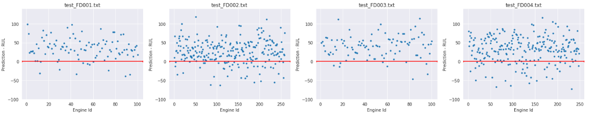
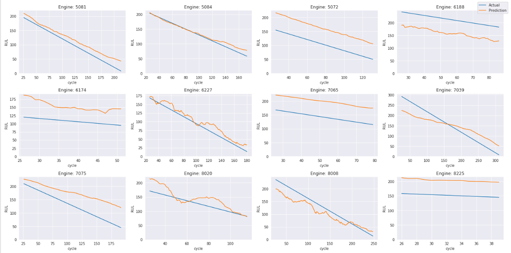

# predictive-maintenance-lstm

## Overview
Determining the time available before a likely failure and being able to predict failures can help business’ 
better plan the use of their equipment, reduce operation costs, and avert issues before they become significant 
or catastrophic. The goal of predictive maintenance (PdM) is to allow for corrective actions and prevent 
unexpected equipment failure.

This project is a continuation of the work began as my project
[Spark ML](https://github.com/sabderra/predictive-maintenance-spark) for CSCI-E63 where
Spark (DataFrames, ML, Structured Streaming, etc) and Kafka were used to build an end-to-end workflow 
for predicting the Remaining Useful Life (RUL) of simulated turbofan engine data.

In this project we focus on using Keras and a Long Short-Term Memory (LSTM) based architecture to create an improved
 prediction model.
 
This repository includes a collection of notebooks:
* [data_analysis.ipynb](data_analysis.ipynb) - Loads and analyzes a sample of the data set.
* [train.ipynb](train.ipynb) - Prepares, transforms the data as well as building the model and training it.
* [model_prediction.ipynb](model_prediction.ipynb) - Runs preditions on the test data.

and utility scripts:
* [data_generator.py](data_generator.py) - Generator that will return time series data for use by an RNN such as LSTM or GRU.
* [data_util.py](data_util.py) - Helper functions for preprocessing and transforming the data.
* [util.py](util.py) - Miscellaneous functions for training.

## Installing Dependencies
To install the packages: 
```bash
pip install -r requirements.txt 
```

Note some of the notebooks use tqdm_notebook for reporting progress, this requires
```bash
conda install -c conda-forge ipywidgets
```
If you don't want to bother with that replace tqdm_notebook with tqdm.

## Data

### Description 
The data used for this project is the NASA C-MAPSS Turbofan Engine Degradation Data Set https://ti.arc.nasa.gov/c/6/.  This data is model based simulated data from the Commercial Modular Aero-Propulsion System Simulation (C-MAPSS).

The data set is a multivariate time series. Each entry (row) in the data set reflects an operational cycle of a specific engine identified by engine id and cycle time. There are multiple entries per engine to represent different reporting times. Other columns represents different features 3 operational settings and 21 sensors:

<pre>
1)      engine id
2)      time, in cycles
3)      operational setting 1
4)      operational setting 2
5)      operational setting 3
6)      sensor measurement  1
7)      sensor measurement  2
...
26)     sensor measurement  21
</pre>

The CMAPSS data set is divided in 4 subsets each for training, test, and RUL (FD001, FD002, FD003, FD004). A subset can have a different operational condition and consists of a different number of engines.

All engines are assumed to be of the same model type and operating normally at the start of each series.  During its series, it develops a fault.

The cycle is a monotonically increasing integer and for the sake of the model it is assumed to be equally spaced and relative for each engine. The following figure shows 10 time series entry for engine 1.


The data is further divided into a training and test set each that requires some subtly interpretation when being processed.

**Training Data Set**
* The last id, cycle entry is when the engine is declared unhealthy. For example if the first engine has 192 distinct time series events the cycle will go from 1 to 192, while the RUL will start with 192 and go down to 1. During data preparation I add an label column called ‘rul’. This is the ground truth. 

**Test Data Set** 
* Goal is to predict the amount of time remaining before the engine fails. This is referred to as the Remaining Useful Life (RUL).
* An engine’s status is terminated prior to actual engine failure. If the time series for an engine in the test data ends at 41, the model’s goal is to identify the RUL at that point.
* Using the provided RUL, a label column (rul) is added to hold the RUL at each time series.  This is generated in the following way: if the RUL is 112 at time series 41, then time series 1 will have an RUL of 153. The RUL is decremented with each succeeding entry.

In total the data is approx 20M compressed.

**Summary**
* NASA C-MAPSS Turbofan Engine Degradation Simulation Data Set https://ti.arc.nasa.gov/c/6/ 
* Size: Training and Test data 20M compressed
* Format: space delimited text files


**Download**

```bash
curl -L https://ti.arc.nasa.gov/c/6/ -o data/CMAPSSDATA.zip
(cd data; unzip CMAPSSDATA.zip)
```

### Generator
To feed the LSTM network and support some experimentation I created a python generator and support functions that provide the following capabilities:
* Return a correctly sized tensor needed by Keras LSTM layer (batch_size, sequence_length, num_features).
* Pad sequences if for a single engine it does not have enough cycles to populate the sequence length.
* Split data set between training and validation
* Shuffle at an engine level
* Loop indefinately as required by Keras

## Model
<p align="center">

</p>

## Results

The RMSE scores on the various test data files.

<center>
 
| FD001  | FD002  | FD003  | FD004  |
|:------:|:------:|:------:|:------:|
| 40.03  | 41.83  | 60.55  | 65.00  |

</center>

The following plot shows how far off each prediction  was. Positive values reflect an over estimate of the RUL, while those that are negative reflect an under estimate.

<p align="center">

</p>

A histogram view shows the peak differences being in the +25 (overestimate) region.

<p align="center">

</p>

Below is a random set of engines taken from each of the test files. The blue line reflects the actual RUL while the yellow line is the predicted RUL. As mentioned earlier, the final actual is take from the ground truth RUL_F00*.txt files. All earlier values are monitonically increasing from this point.

<p align="center">

</p>
